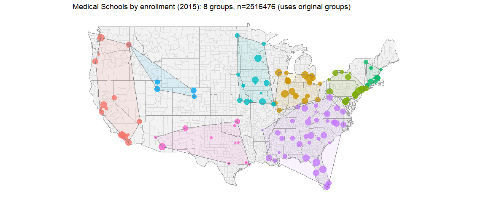
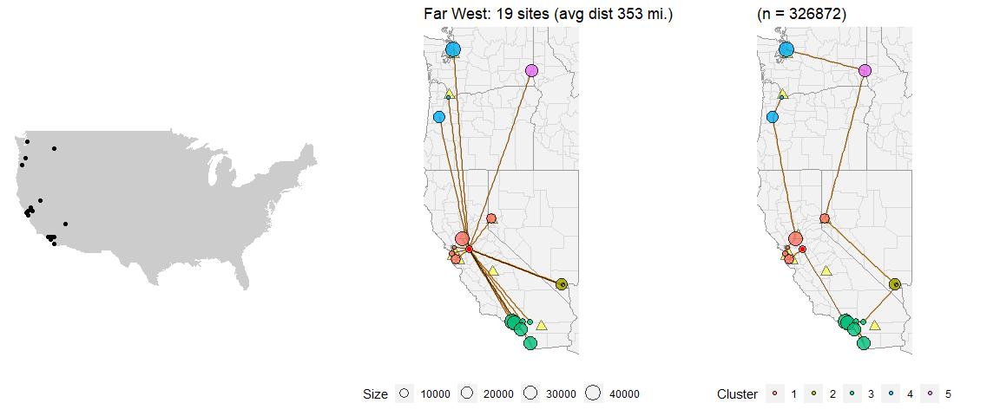
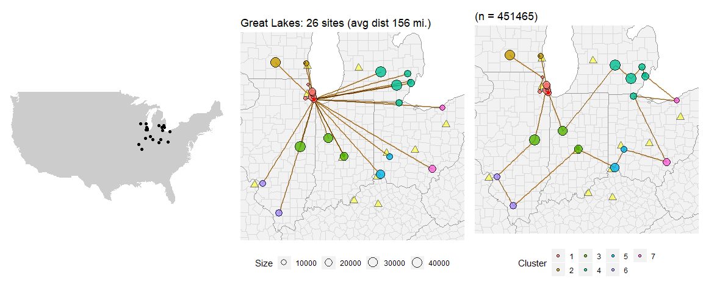
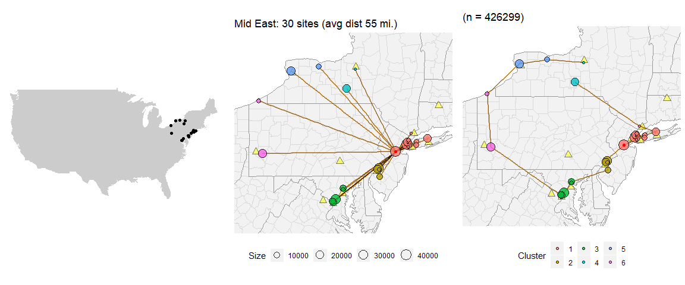
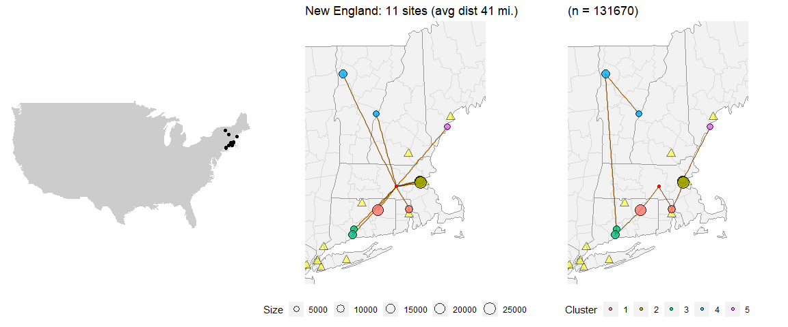
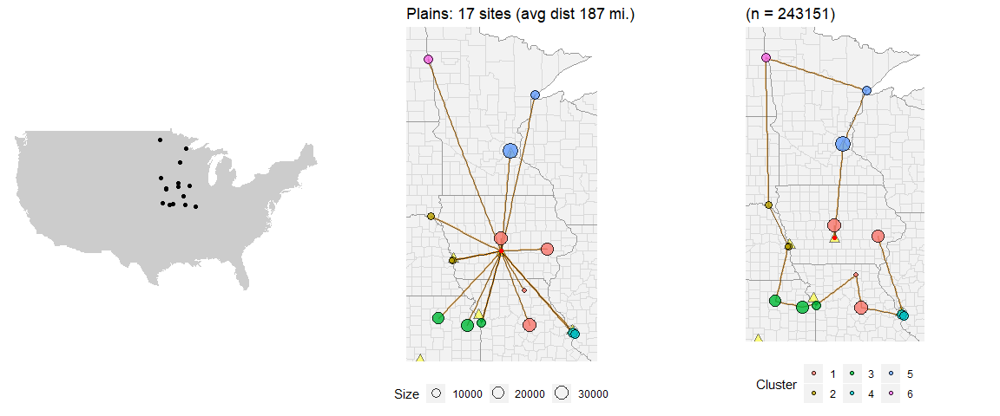
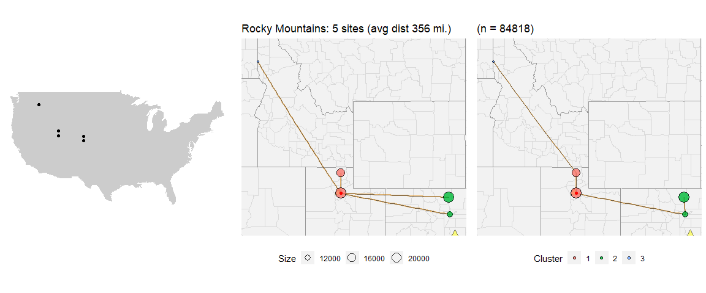
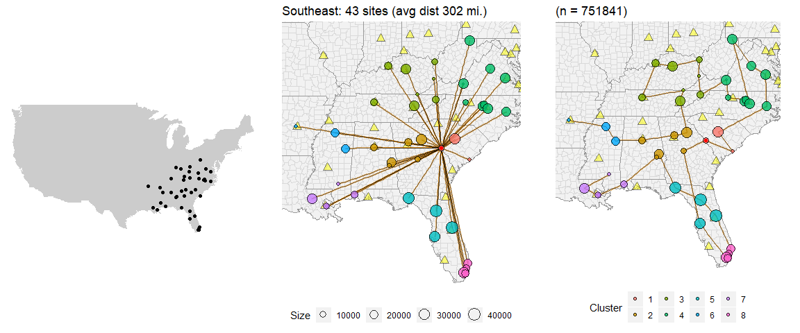
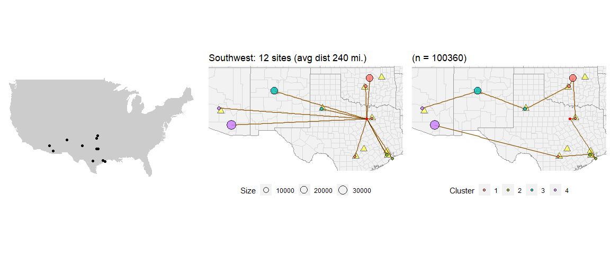

Distances to Centroids & TSP across Groups
================
Jake Riley, 2016

### Set workspace

### Read in locations

you can change this to bring in your own data as long as the coordinates are WGS84 and in a dataframe. Use the bottom half of this chunk to clarify which columns have your coordinates, unique IDs, grouping value and the column to be used for weighting (a numeric value)

``` r
locations <-
  read.csv("medschools.csv", stringsAsFactors = FALSE)

# identify the following variables
locations$id <- locations$unit_id # the unique identifier for each site
locations$lon <- locations$lon # Y coord
locations$lat <- locations$lat # X coord
locations$value <- locations$enrollment # size of points, weight for clustering

# What does this data describe
data_title <- "Medical Schools by enrollment (2015)"

# Want to use groups?
# If yes, write "TRUE" and assign a group.
# If no, write "FALSE" and then select clustering method
use_group <- TRUE
locations$group <- locations$region # column to group by geographically

# clsutering method
cluster_method <- c(
  "ward.D", "ward.D2", "single", "complete",
  "average", "mcquitty", "median", "centroid"
)
which_cluster_method <- 1 # defaults to 1: hclust(method = "ward.D")
```

The code should run from here

### What to do about groups: `use original groups`

Read in airports

Create centers by finding the centroids of each group, then find the closest site to the centroid, then calculate distances to that central location

Generate map elements

Generate polygon outlines

Show basemap 

### Create maps

Create three maps within each group:

-   map showing region
-   straight lines to central location
-   shortest path through all points

Points are clustered within each region as a guide for the decision making process.



### Useful links

-   <http://stackoverflow.com/questions/27363653/find-shortest-path-from-x-y-coordinates-with-start-%E2%89%A0-end>

-   <https://operatiology.wordpress.com/2014/05/31/tsp-with-latitudelongitude-coordinate-input-in-r/>

for more information contact: <rjake@sas.upenn.edu>
